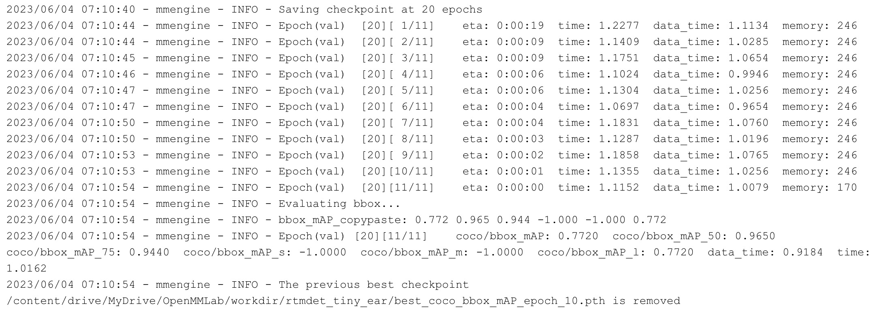
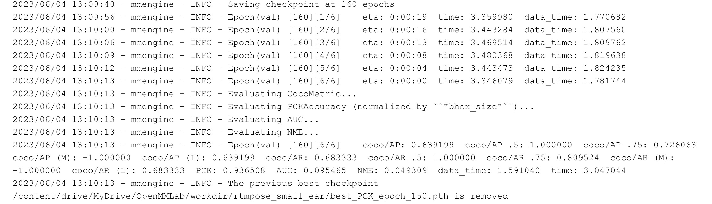
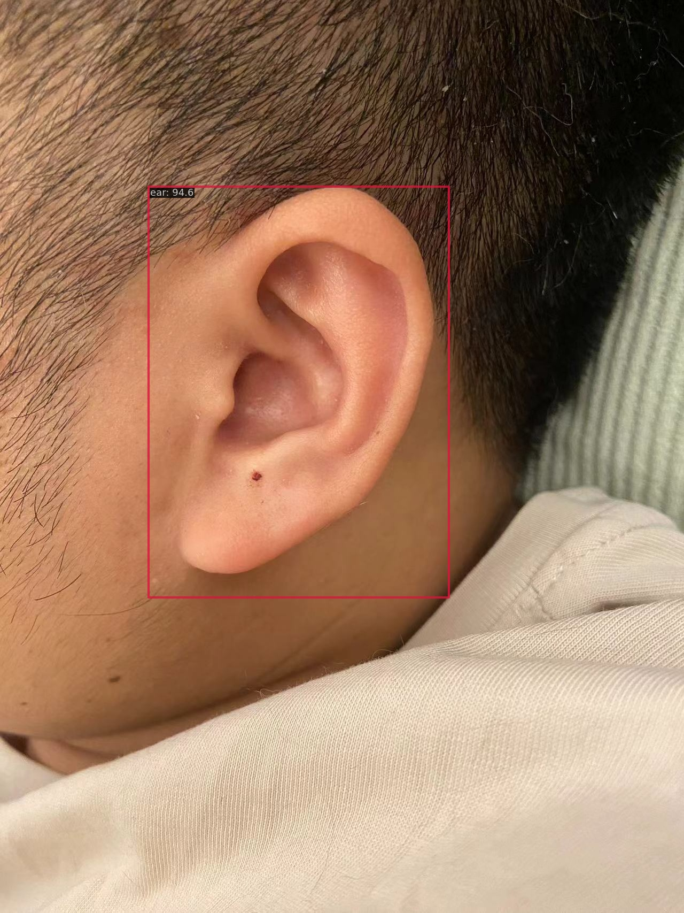
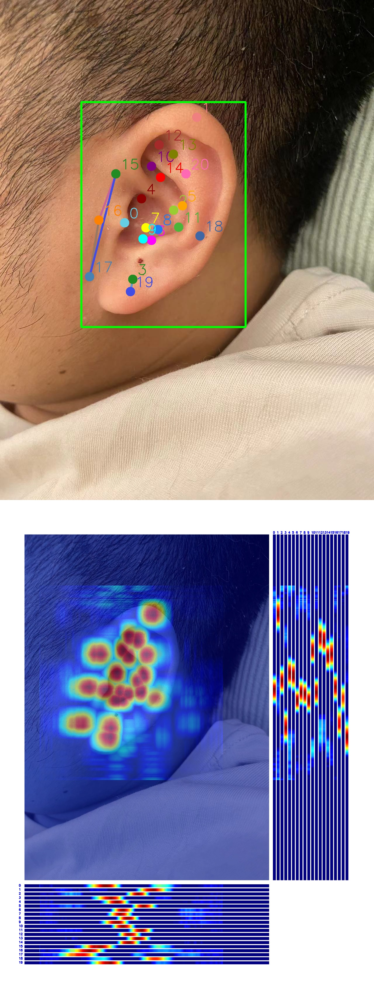

# 📖 Exercise_1代码内容
主要参考同济子豪兄的repo：[TommyZihao/MMPose_Tutorials](https://github.com/TommyZihao/MMPose_Tutorials/tree/main/2023/0524)
## 📁 1.文件结构
```bash
.
└── Exercise_1 # 基于RTMPose的耳朵穴位关键点检测
    ├── ear_test.jpeg # 测试图像
    ├── Exercise1.ipynb # 整体脚本
    ├── REAME.md # 任务说明
    ├── checkpoint # 权重文件
    ├── outputs # 测试输出结果
    ├── rtmdet_tiny_ear.py # det模型的配置
    └── rtmpose-s-ear.py # pose模型的配置
```

## 📈 2.训练指标
直接用的colab免费版，所以训练时间有限，达到作业要求就停了。

检测模型


姿态估计模型


## 🎆 3.测试图像

检测结果



姿态估计结果



----
# 🏷️ 任务介绍
原链接位于：[【AI实战营第二期】第一次作业提交12班 #93](https://github.com/open-mmlab/OpenMMLabCamp/issues/93)

**题目**：基于RTMPose的耳朵穴位关键点检测

**背景**：根据中医的“倒置胎儿”学说，耳朵的穴位反映了人体全身脏器的健康，耳穴按摩可以缓解失眠多梦、内分泌失调等疾病。耳朵面积较小，但穴位密集，涉及耳舟、耳轮、三角窝、耳甲艇、对耳轮等三维轮廓，普通人难以精准定位耳朵穴位。

**任务**
1. Labelme标注关键点检测数据集（子豪兄已经帮你完成了）
2. 划分训练集和测试集（子豪兄已经帮你完成了）
3. Labelme标注转MS COCO格式（子豪兄已经帮你完成了）
4. 使用MMDetection算法库，训练RTMDet耳朵目标检测算法，提交测试集评估指标
5. 使用MMPose算法库，训练RTMPose耳朵关键点检测算法，提交测试集评估指标
6. 用自己耳朵的图像预测，将预测结果发到群里
7. 用自己耳朵的视频预测，将预测结果发到群里

需提交的测试集评估指标（不能低于baseline指标的50%）
+ 目标检测Baseline模型（RTMDet-tiny）

+ 关键点检测Baseline模型（RTMPose-s）


**数据集**
+ 耳朵穴位关键点检测数据集，MS COCO格式，划分好了训练集和测试集，并写好了样例config配置文件
+ 链接: https://pan.baidu.com/s/1swTLpArj7XEDXW4d0lo7Mg 提取码: 741p
+ 标注人：张子豪、田文博


