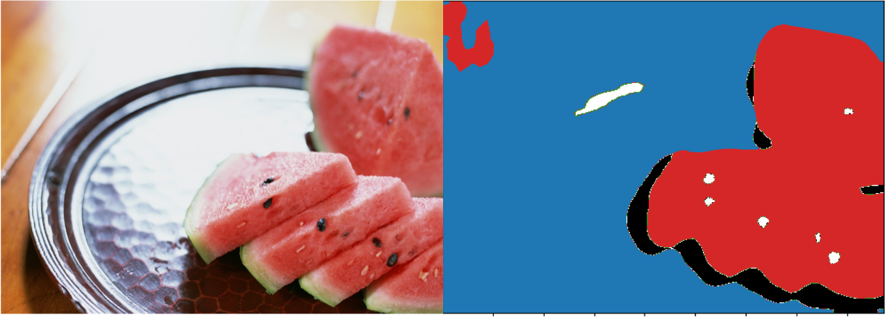

# 📖 Exercise_4
主要参考: <https://github.com/open-mmlab/mmdetection/blob/tutorials/demo/MMDet_Tutorial.ipynb>

## 📁 1.文件结构

```bash
.
└── Exercise_4 # 西瓜语义分割
    ├── DubaiConfig # 注册数据和config文件示例demo
    │   ├── DubaiDataset_pipeline.py
    │   ├── __init__.py
    │   └── pspnet_r50-d8_4xb2-40k_DubaiDataset.py
    ├── Exercise_4.ipynb # 主要脚本
    ├── checkpoint
    │   ├── 20230618_100453.json
    │   ├── 20230618_100453.log # 日志
    │   └── iter_1000.pth # 最优权重
    ├── img
    │   ├── 25watermelon.png
    │   ├── test_watermelon.jpg # 测试图片
    │   └── test_watermelon_rs.png # 测试结果
    └── pspnet-watermelon_20230618.py # 训练使用的配置文件
```

## 📈 2.训练指标
验证集评估指标
```bash
+------------+-------+-------+
|   Class    |  IoU  |  Acc  |
+------------+-------+-------+
|    red     |  95.5 | 96.73 |
|   green    | 92.21 | 97.51 |
|   white    | 83.76 | 95.16 |
| seed-black | 79.27 | 88.49 |
| seed-white | 48.04 |  58.1 |
|  tabBlue   |  0.0  |  0.0  |
+------------+-------+-------+
06/18 10:17:41 - mmengine - INFO - Iter(val) [11/11]    aAcc: 95.8700  mIoU: 66.4600  mAcc: 72.6600  data_time: 0.0103  time: 0.0317
```

测试集评估指标
```bash
+------------+-------+-------+
|   Class    |  IoU  |  Acc  |
+------------+-------+-------+
|    red     |  95.5 | 96.73 |
|   green    | 92.21 | 97.51 |
|   white    | 83.76 | 95.16 |
| seed-black | 79.27 | 88.49 |
| seed-white | 48.04 |  58.1 |
|  tabBlue   |  0.0  |  0.0  |
+------------+-------+-------+
06/18 10:31:13 - mmengine - INFO - Iter(test) [11/11]    aAcc: 95.8700  mIoU: 66.4600  mAcc: 72.6600  data_time: 0.1341  time: 0.1852
```

## 🎆 3.测试图像




---
# 🏷️ 任务介绍

原链接位于：[【AI实战营第二期】第四次作业提交12班 #393](https://github.com/open-mmlab/OpenMMLabCamp/issues/393)

**题目**：MMSeg 语义分割

**背景**：西瓜瓤、西瓜皮、西瓜籽像素级语义分割

**任务**
1. Labelme 标注语义分割数据集（子豪兄已经帮你完成了）
2. 划分训练集和测试集（子豪兄已经帮你完成了）
3. Labelme 标注转 Mask 灰度图格式（子豪兄已经帮你完成了）
4. 使用 MMSegmentation 算法库，撰写 config 配置文件，训练 PSPNet 语义分割算法
5. 提交测试集评估指标
6. 自己拍摄西瓜图片和视频，将预测结果发到群里
7. （选做）训练 Segformer 语义分割算法，提交测试集评估指标
 

**西瓜瓤、西瓜籽数据集**
+ Labelme标注格式（没有划分训练集和测试集）：https://zihao-openmmlab.obs.cn-east-3.myhuaweicloud.com/20230130-mmseg/dataset/watermelon/Watermelon87_Semantic_Seg_Labelme.zip
+ Mask标注格式（已划分训练集和测试集）：https://zihao-openmmlab.obs.cn-east-3.myhuaweicloud.com/20230130-mmseg/dataset/watermelon/Watermelon87_Semantic_Seg_Mask.zip


| 类别名称     | 类别语义      | 标注类别               | 灰度图像素值 |
| ----------- | ------------ | --------------------- | ------------ |
| /           | 背景         | /                     | 0            |
| red         | 西瓜红瓤     | 多段线（polygon）       | 1            |
| green       | 西瓜外壳     | 多段线（polygon）       | 2            |
| white       | 西瓜白皮     | 多段线（polygon）       | 3            |
| seed-black  | 西瓜黑籽     | 多段线（polygon）       | 4            |
| seed-white  | 西瓜白籽     | 多段线（polygon）       | 5            |
	


