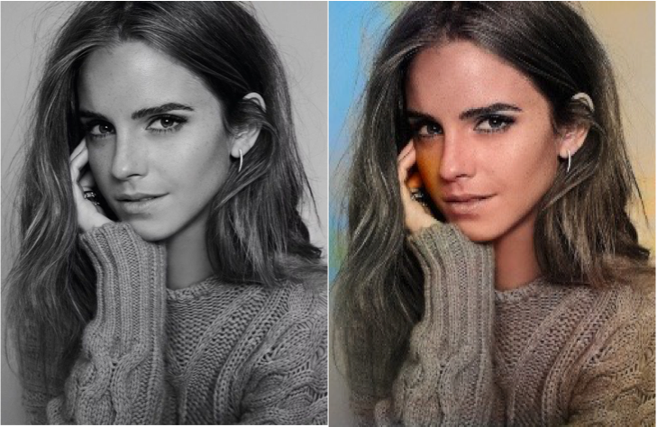
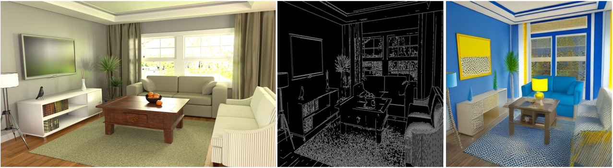
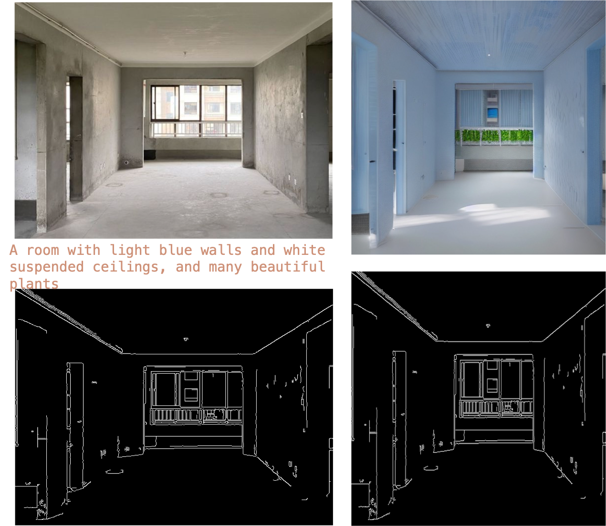
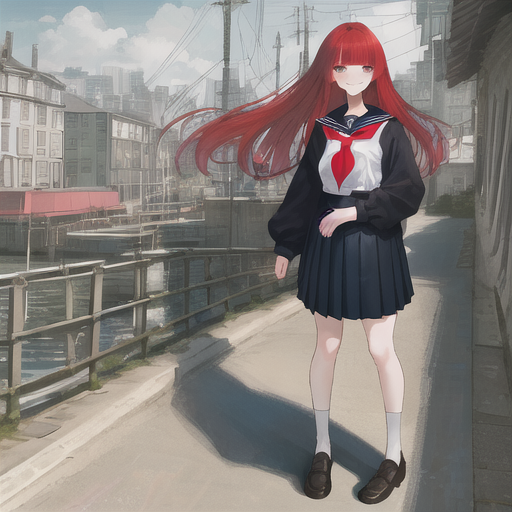

# 📖 Exercise_5
主要参考: <https://github.com/open-mmlab/mmdetection/blob/tutorials/demo/MMDet_Tutorial.ipynb>

## 📁 1.文件结构

```bash
.
└── Exercise_5 # 基于mmagic的AIGC方面应用
    ├── Exercise_5.ipynb # 主要脚本
    ├── README.md
    └── image
        ├── 1.colorImage.png # 上色图像示例
        ├── 2.canny2image_1.png # 图（线稿）生图
        ├── 3.homework.png # 任务
        ...
        └── ...
```


## 🎆 2.测试图像
1. 基于`inst_colorization`模型上色




2. 图（线稿）生图(ControlNet)示例1：
```python
prompt='Room with blue walls and a yellow ceiling.'
```


3. 图（线稿）生图(ControlNet)示例2：
```python
prompt='A room with light blue walls and white suspended ceilings, and many beautiful plants
```


4. 图（pose）生图(ControlNet)示例:
```python
prompt = 'masterpiece, best quality, sky, red hair, skirt, sailor collar, looking at viewer, long hair, building, bangs, neckerchief, long sleeves, sunny sky, power lines, shirt, cityscape, pleated skirt, scenery, blunt bangs, city, daylight, black sailor collar,smile face, big eyes'
```


5. 文生图（Stable Diffusion）示例：
```python
prompt = 'Anime-style headshot of a beautiful big-eyed girl looking at a cute black cat'

```


---
# 🏷️ 任务介绍

原链接位于：[【AI实战营第二期】第四次作业提交12班 #405](https://github.com/open-mmlab/OpenMMLabCamp/issues/405)

**题目**：作业：ControlNet 的 N 种玩法

假设你是某装修公司的设计师，客户发了你毛坯房的照片，想让你设计未来装修好的效果图。
先将毛坯房照片，用 OpenCV 转为 Canny 边缘检测图，然后输入 ControlNet，用 Prompt 咒语控制生成效果。
将毛坯房图、Canny 边缘检测图、咒语 Prompt、ControlNet 生成图，做成一页海报，发到群里。
	


