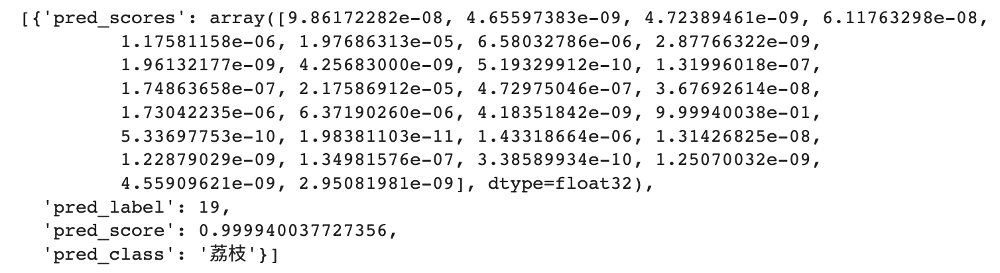
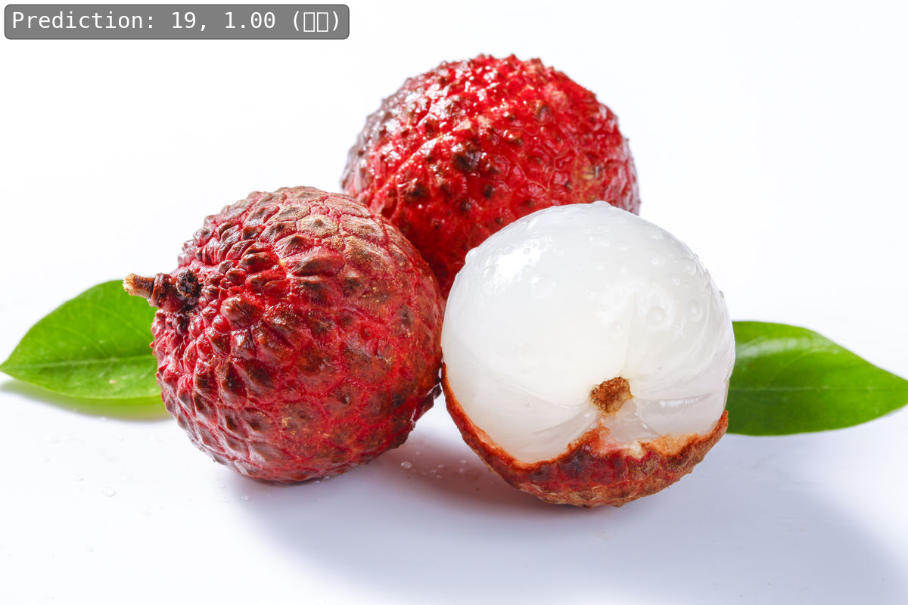

# 🤖 简介
这个系列是OpenMMLab实战训练营第二期的学习记录，
+ 关于这个训练营的详细介绍，可以去看看：[open-mmlab/OpenMMLabCamp](https://github.com/open-mmlab/OpenMMLabCamp)
+ 我个人的博客文字记录，位于CSDN博客专栏：[OpenMMLab-AI实战营第二期](https://blog.csdn.net/castlehe/category_12337830.html)

# 🤖 作业说明
作业一已经的README已经移至：`Exercise_1/README.md`中

## 📖 Exercise_2
主要参考mmpretrain文档：
+ [如何在自定义数据集上微调模型](https://mmpretrain.readthedocs.io/zh_CN/latest/notes/finetune_custom_dataset.html)
+ [准备数据集-标注文件方式](https://mmpretrain.readthedocs.io/zh_CN/latest/user_guides/dataset_prepare.html#id3)

### 📁 1.文件结构
```bash
.
└── Exercise_2 # 基于 ResNet50 的水果分类
    ├── Exercise_2.ipynb # 主要脚本
    ├── README.md
    ├── checkpoints
    │   ├── 20230608_032750.log # 日志
    │   └── best_accuracy_top1_epoch_9.pth # 最优权重（默认下载的resnet50_8xb32_in1k_20210831-ea4938fc.pth预训练模型是102.5MB，训练得到的差不多也是94.7MB左右）
    ├── fruit30_meta # 数据划分训练集、验证集和测试集结果
    │   ├── test.txt
    │   ├── train.txt
    │   └── val.txt
    ├── generateAnnTxt.ipynb # 划分数据集使用的脚本
    ├── resnet18_finetune_catsdogs.py # 猫狗分类的配置文件
    └── resnet50_finetune_fruits.py # 水果分类的配置文件
```

### 📈 2.训练指标
验证集评估指标


测试集评估指标


### 🎆 3.测试图像
结果：



图像：




