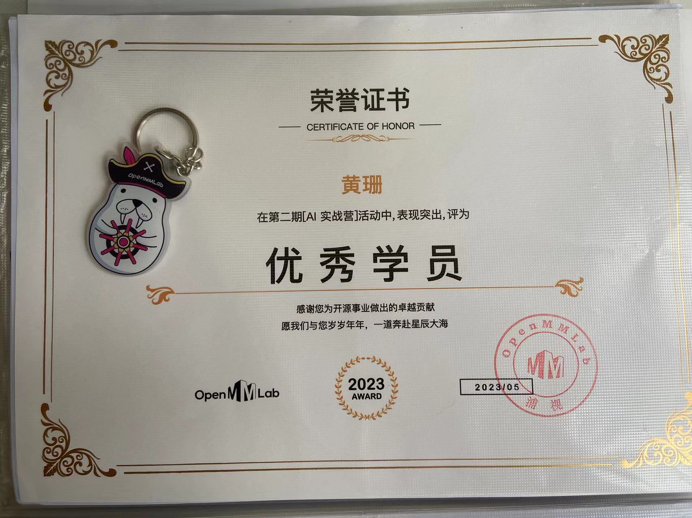

# 🤖 简介
这个系列是OpenMMLab实战训练营第二期的学习记录，
+ 关于这个训练营的详细介绍，可以去看看：[open-mmlab/OpenMMLabCamp](https://github.com/open-mmlab/OpenMMLabCamp)
+ 我个人的博客文字记录，位于CSDN博客专栏：[OpenMMLab-AI实战营第二期](https://blog.csdn.net/castlehe/category_12337830.html)

# 📁文件结构说明
```bash
.
├── Exercise_1（MMPose） # 课程练习
├── Exercise_2（MMPretrain）
├── Exercise_3（MMDetection）
├── Exercise_4（MMSegmentation）
├── Exercise_5（MMagic）
├── README.md
├── image # 课程用到的一些结果图像和测试用例图像
├── otherDoc # 课程ppt文档
├── datasets # 练习用的简单数据集
└── utils #其他相关代码
```

# 🌈 作业说明
+ 作业一的README已经移至：`Exercise_1/README.md`中
+ 作业二的README已经移至：`Exercise_2/README.md`中
+ 作业三的README已经移至：`Exercise_3/README.md`中
+ 作业四的README已经移至：`Exercise_4/README.md`中
+ 作业五的README已经移至：`Exercise_5/README.md`中

# 📌学习结果
2023.7.8，终于收到快递啦，一个证书，一个**鼠标垫**（鼠标垫真的不错），一个钥匙扣




# ♾️ 后续社区PR
算是为开源做贡献了吧🌈🌈🌈

|num|level|link|merge time|
|---|---|---|---|
|1|easy|<https://github.com/open-mmlab/mmsegmentation/pull/3158>|2023.7.14|

