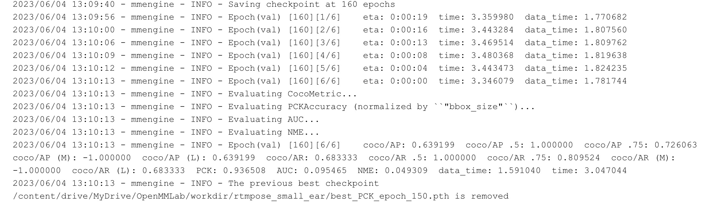

# 简介
这个系列是OpenMMLab实战训练营第二期的学习记录，
+ 关于这个训练营的详细介绍，可以去看看：[open-mmlab/OpenMMLabCamp](https://github.com/open-mmlab/OpenMMLabCamp)
+ 我个人的博客文字记录，位于CSDN博客专栏：[OpenMMLab-AI实战营第二期](https://blog.csdn.net/castlehe/category_12337830.html)

# Exercise_1
## 文件结构
```bash
.
└── Exercise_1 # 基于RTMPose的耳朵穴位关键点检测
    ├── Exercise1.ipynb # 整体脚本
    ├── checkpoint # 权重文件
    ├── outputs # 测试输出结果
    ├── rtmdet_tiny_ear.py # det模型的配置
    └── rtmpose-s-ear.py # pose模型的配置
```

## 训练指标
直接用的colab免费版，所以训练时间有限，达到作业要求就停了。

检测模型


姿态估计模型


## 测试图像

检测结果


姿态估计结果


